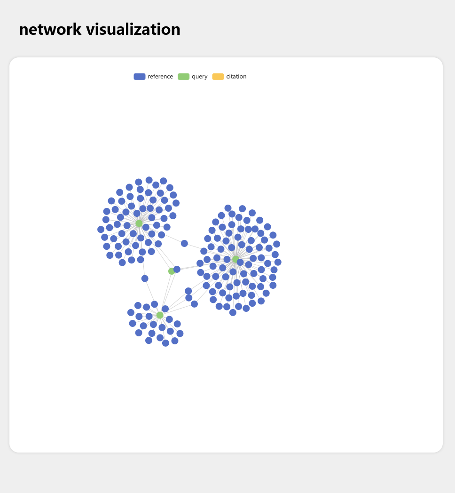

# Citation map visualization tool

This project is aimed at make a citation map visualizing tool, which can visualize the reference/citation relations of articles on PubMed dataset.

## Project Structure

```text
./
|-   app.py
|-   citation_map.json
|-   example.PMID.txt
|-   index.html
|-   README.md
|   
\---img
     \--- example.png
```

## Working mode

First, we define three kinds of articles:

1. **Query articles:** These articles are user input, and we will use these "Query" to query PubMed dataset.
2. **Reference articles:** These articles are "Query"'s reference, in other words, "Query" articles cited these articles.
3. **Citation articles:** These articles are "Query"'s citation, in other words, "Query" articles are cited by these articles.

Right now we can extract "Reference" from Pubmed, and in the future we will extract "Citation" articles as well

When user input a list of articles' PMID(this is important! the input should be PMID), we will make a query to PubMed by its web API, and get a report in XML format. 
Then we will parse this XML report and generate a `.json` file, which contains information of graph nodes(article) and graph edges(citation relation). 
Finally, we will use [Echarts](echarts.apache.org/) to visualize this citation map graph. The final report is in `.html` format , and you need to open your browser to read and interact with it.

## Installation and requirements

All requirements:


+ `python(>=3.6)` with [The Python Standard Library](https://docs.python.org/3/library/index.html)
+ `requests(>=2.27)`.

This program don't need installation; just download these file is enough. 

## Usage

The build-in help text is:

```text
usage: app.py [-h] [-f FILE | -l LIST] [-m MAX] [-p PORT]

optional arguments:
  -h, --help            show this help message and exit
  -f FILE, --file FILE  PMID list file.
  -l LIST, --list LIST  PMID list(comma seperate).
  -m MAX, --max MAX     Max limitation of query article number. Default is 10.
  -p PORT, --port PORT  Network port of the report server. Default is using
                        random number.
```

To use this program, first you need to prepare a list of [PMIDs](https://support.nlm.nih.gov/knowledgebase/article/KA-05233/en-us). You can storage them into a seperate text file, or just copy to the clip-board. Then you open a terminal and switch working directory to where you download this project. You have two method to launch this program:

### 1. load pmid list from text file

This method will load pmids from a seperate text file. in that text file, each id occupies a separate row, and there should no blank before pmid.

Example:

```text
24651067
32286628
32184769
31606751
```

PMID list file also can contain comment text, but comment text should start with a "#" character.

Example:

```text
# These articles are some studies about CRISPR-Cas9 technology
24651067 # Hum Mol Genet. 2014 Sep 15;23(R1):R40-6.
32286628 # Nucleic Acids Res. 2020 May 21;48(9):4698-4708.
32184769 # Front Microbiol. 2020 Feb 28;11:282.
31606751 # Hum Genet. 2019 Dec;138(11-12):1217-1225
```

The above PMID list file names `example.PMID.txt`, and is storaged in current directory. Then use the following command to launch the program:

```bash
python ./app.py -f ./example.PMID.txt
```

The program will load PMID list and get citation relation from PubMed web API. You will see the output as below:

```text
~$ python ./app.py -f ./example.PMID.txt
Max limitation of query article number is 10.
https://eutils.ncbi.nlm.nih.gov/entrez/eutils/efetch.fcgi?db=pubmed&id=24651067,32286628,32184769,31606751
Default port number will be set.
The report is serving at port 15501.
Please open the following URL to check report:  http://localhost:15501
To stop web server, Press `Ctrl+C`
127.0.0.1 - - [12/Dec/2023 21:10:40] "GET / HTTP/1.1" 200 -
127.0.0.1 - - [12/Dec/2023 21:10:41] "GET /citation_map.json HTTP/1.1" 200 -
```

You can open your web browser and access the URL which is mentioned in the output. 




### 2. load pmid list from command line

This method will load pmids from command line. in this method, the argument `-l` will be used. You should provide a comma seperate-PMID list, like this:

```bash
python ./app.py -l 24651067,32286628,32184769,31606751
```

The output is the same as above method.


## Pitfalls

1. Due to the limitation of PubMed web API, some articles' reference list cannot load correctly. Therefore, the report cannot display all citation relationships.
2. Current version of this program only can display reference network. In the future we will support citation network.
3. If input too much articles into program, the render on the web browser will be very slow. Recommend input is less than 10 articles. In the future we will support node pruning, which will remove some low citation/reference articles.


